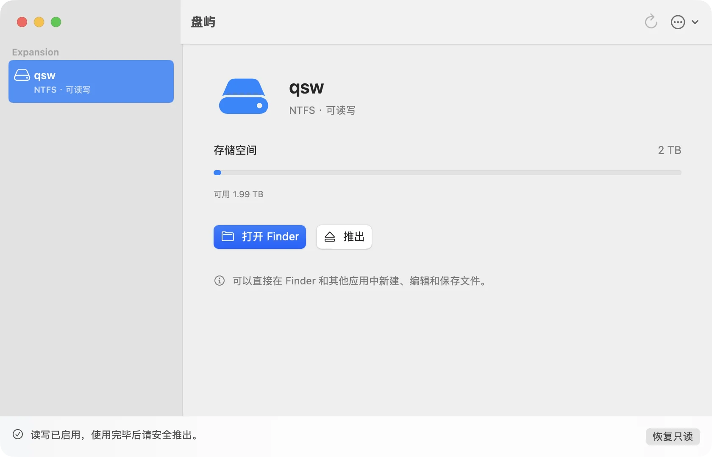

# 盘屿 Volisle

**让硬盘，在 Mac 上自在读写。** 免费开源的 Mac NTFS 读写工具，基于 macOS 的 FSKit 用户态文件系统，不装内核扩展、不改安全设置。

官网与下载：<https://qisw.top/volisle/> · English: <https://qisw.top/volisle/en/>



## 功能

- 插上 Windows 的 NTFS 硬盘或 U 盘，检查通过后自动开启读写，直接在访达里拷贝、修改、删除。
- 拔线保护：每次写入都有恢复记录，意外拔线后插回会先回滚到一致状态，再开启读写。
- BitLocker 加密盘：输入密码或 48 位恢复密钥解锁后读写。
- 盘需要检查、来自休眠或“快速启动”的 Windows、上次没有安全弹出时，保持只读并说明原因；也可以在 Mac 上检查并清除“需要检查”标记。
- 抹掉为 NTFS；自动更新；中英文界面。
- 没有账号、统计或遥测，文件不离开你的电脑。

## 系统要求

需要 Apple 芯片 Mac、macOS 15.4 或更高版本（0.8.2 起；此前为 26.4）。完整验证在 macOS 27.2 上完成；macOS 15.6.1 在虚拟机里验证了主要磁盘流程，15.4 本身与 macOS 15 上的实体 USB 硬盘尚未实测，详见[兼容性](https://qisw.top/volisle/compatibility/)。

## 反馈

在本仓库 [提交 issue](../../issues/new/choose)。附上诊断报告最有帮助：盘屿“设置与诊断… → 支持 → 导出诊断…”，报告不含卷名、路径、磁盘标识和文件内容。安全问题请看 [SECURITY.md](SECURITY.md)，不要公开提交。

## 从源码构建

需要 Apple 芯片 Mac、macOS 26.4 或更高版本、Xcode 27、Python 3、pnpm（官网）。

```bash
# 核心库单元测试
swift test --package-path packages/VolisleCore

# NTFS 引擎（下载并核对固定版本的 NTFS-3G 源码，编译桥接库，跑镜像测试）
python3 scripts/prepare-ntfs-probe.py
zsh scripts/build-ntfs-bridge.sh
python3 scripts/test-ntfs-bridge.py

# 未签名的应用包（会下载并核对 NTFS-3G 与 Sparkle 源码）
python3 scripts/prepare-extension-bundle.py --bundle-id <你的 Bundle ID> --daily-write --output-dir apps/macos/build/review
```

**签名限制**：macOS 只加载带 FSKit 模块权限签名的文件系统扩展。要在自己的 Mac 上真正挂载磁盘，需要 Apple 开发者账号、带 `com.apple.developer.fskit.fsmodule` 的描述文件，以及自己的 Bundle ID；签名与发布流程见 [docs/release/自己发布新版本.md](docs/release/自己发布新版本.md)，个人配置放在 `config/release.local.env`（参考 `config/release.local.env.example`）。

每个正式版本的完整源码包（含构建脚本与第三方许可声明，可离线重新构建）都在[官网下载页](https://qisw.top/volisle/download/)，与安装包一一对应。

## 目录

| 目录 | 内容 |
|---|---|
| `apps/macos` | 主应用、后台组件（root launchd 服务） |
| `apps/extension` | FSKit 文件系统扩展、写入日志与拔线恢复 |
| `apps/web` | 官网（Next.js 静态导出） |
| `packages/VolisleCore` | 磁盘发现、挂载流程、后台通信等核心逻辑与单元测试 |
| `packages/VolisleNTFS` | NTFS-3G 桥接层、BitLocker 解密层 |
| `scripts` | 构建、签名、测试与发布脚本 |
| `docs/testing` | 每项功能的测试记录 |

## 许可

源码按 [GNU GPL v2](LICENSE) 发布；第三方代码保留各自许可，详见 [LICENSE_SCOPE.md](LICENSE_SCOPE.md)、`packages/VolisleNTFS/UPSTREAM.md`。“盘屿”“Volisle”名称和图标不随 GPL 授权：修改后的版本请使用别的名称和图标发布。

---

# Volisle

**Your drives, read-write on Mac.** A free, open-source NTFS read-write tool for Mac, built on macOS FSKit user-space file systems: no kernel extension, no lowered security settings.

Website and download: <https://qisw.top/volisle/en/>

## Features

- Connect a Windows NTFS drive or USB flash drive; once it passes the check, write access turns on automatically and you use it in Finder.
- Unplug protection: every write is journaled; after an accidental unplug the disk is rolled back to a consistent state before writing resumes.
- BitLocker: unlock with the password or 48-digit recovery key, then read and write.
- Disks that need a check, come from a hibernated Windows (or Fast Startup), or weren't ejected safely stay read-only, with the reason shown.
- Erase as NTFS; automatic updates; Chinese and English interface.
- No account, analytics or telemetry; your files never leave your Mac.

## Requirements

Requires a Mac with Apple silicon and macOS 15.4 or later (since 0.8.2; earlier versions required 26.4). Full verification was done on macOS 27.2; main disk workflows were verified in a macOS 15.6.1 virtual machine. macOS 15.4 itself and physical USB drives on macOS 15 have not been tested yet.

## Feedback

[Open an issue](../../issues/new/choose) here; a diagnostics report (Settings & Diagnostics… → Support → Export Diagnostics…) helps most. For security issues see [SECURITY.md](SECURITY.md).

## Building from source

See the commands above. macOS loads a file system extension only when it is signed with the FSKit module entitlement, so actually mounting disks needs an Apple developer account, a provisioning profile with `com.apple.developer.fskit.fsmodule` and your own bundle identifier. The complete source package of every release is on the [download page](https://qisw.top/volisle/en/download/).

## License

GNU GPL v2 ([LICENSE](LICENSE)); third-party code keeps its own licenses ([LICENSE_SCOPE.md](LICENSE_SCOPE.md)). The names “盘屿” and “Volisle” and the icon are not licensed under the GPL: please ship modified versions under a different name and icon.
