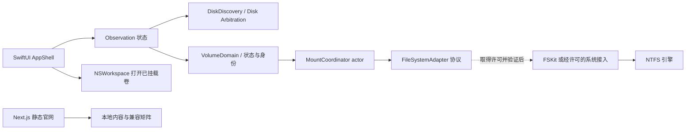

# 盘屿 Volisle：方案与实施计划

日期：2026-09-19。依据：用户原始需求及后续商业化方向；项目从空目录起步，现已交付研发基础；现有路径保留为 `Volisle`，逻辑仓库名称 `volisle`，不重命名正在使用的工作区。本文为当前执行基线，不代表正式发布批准。

## 范围与成功条件

普通 Mac 用户连接 Windows NTFS 移动盘，识别状态、在有证据支持的环境中开启读写、在 Finder 中使用并安全推出。客户端离线工作；官网独立静态构建。首版排除账号、支付、修复、格式化、BitLocker 解锁、自研完整文件系统。品牌名称是工作名称；不得猜测已拥有的域名、Bundle ID 和 Developer Team。

最终验收必须有 Finder 挂载、写读哈希、改名移动删除、卸载重挂以及 Windows 检查，单独编译和镜像工具读写均不足以放行。没有测试盘、引擎许可或 Windows 条件时，保留明确标注的独立成果。

## 三条路线

| 路线 | 适用 | 取舍 | 当前决定 |
| --- | --- | --- | --- |
| 商业 SDK（Paragon UFSD / Tuxera 商业引擎） | 商用正式版，厂商支持 | 报价、SDK 可获得性、macOS 用户态接入与再分发均需书面核实；消费版许可不等于 OEM | 历史候选，当前暂停询价与采购 |
| NTFS-3G + macFUSE FSKit | 低成本、短期验证 | GPL 与 macFUSE 商业捆绑限制；必须明确选择 FSKit，不能落回内核后端；用户态不等于免授权 | 对照候选，尚未安装后端，不默认捆绑 |
| NTFS-3G 核心 + 直接 FSKit 适配 | 长期掌控接入层 | GPL、块 I/O 对齐、目录语义、缓存、同步、崩溃恢复、安全检查工作量大 | 当前优先审计和验证路径，不视为已有驱动 |

当前决定（2026-09-20 更新）：先做免费开源版，优先复用经审计的 GPL NTFS 核心及直接 FSKit 桥接；后续评估 Mac App Store 收费。商业 SDK 不再作为前置依赖，不推进站外支付或激活服务。源码组合许可与商店分发条件须独立核验，详见 `docs/product/开源与商业化规划.md`。

技术基线：原生客户端通过协议隔离引擎。开源组合许可与实际安全验证完成前不将候选捆绑为可写产品。15.4+ 仅作为 FSKit 调研起点，不能从本机 27.2 推断所有版本兼容。

## 架构

初期一个 Swift Package `VolisleCore` 内聚 VolumeDomain、DiskDiscovery、FileSystemAdapters、MountCoordinator；macOS App 单独 Swift Package 可执行目标。无职责的服务不先创建。引擎缺失必须返回结构化不可用结果，不返回成功。UI 不暴露通用 shell 或 root 协议；本阶段不安装辅助服务。

磁盘状态拆为“观察到的挂载状态”与“盘屿的操作能力”。其他驱动将 NTFS 挂为可写时，只报告系统当前状态，不能说是盘屿启用的读写。容量未知是未知，不是零。物理设备分组取系统设备路径；无可靠关系时单独显示，不能凭名称合并。可用容量为文件系统统计，APFS 共享空间不相加。

身份：卷 UUID + 媒体 UUID + 设备路径 + 本次连接 generation；BSD 编号仅作短期定位，断开后失效。自动挂载只接受稳定身份，所有写入前重新检查同一对象、系统卷、引擎、安全结果和冲突。每个物理设备串行操作，失败不自动重试。未知风险按拒绝写入处理。

安全推出（阶段 2）：卸载单卷和推出整个设备是不同操作；设备级锁、枚举所有子卷、非强制卸载、逐一重新核验、失败停止，全部完成才能 DADiskEject；不保证多卷卸载原子性，不在失败后自动重新挂载。超时进入待核验状态，不能释放设备锁后立刻开始另一写操作。

## 原生设计

NavigationSplitView 原生侧栏，物理设备与卷分组。详情以磁盘图标、卷名、状态、容量、Finder 操作为中心。工具栏刷新与诊断。菜单栏显示真实磁盘，支持打开主窗与 Finder。浅深色随系统，可在设置调整。引擎、自动挂载、登录启动等未实现项为解释性文字或禁用控件，不能可点击后假成功。文案集中本地化，简体中文默认，英文资源可扩展。

状态设计：无磁盘提示连接；首次连接解释只观察状态；只读与可写显示系统状态；未挂载不可打开 Finder；引擎缺失解释读写未开放；系统不支持说明范围；授权中/挂载中展示进行态并锁定动作；危险卷拒绝写入；忙碌提示关闭使用磁盘的应用；操作失败保留具体原因。后六类在未接入引擎时仅有状态模型与测试，不伪造生产触发。

## 官网设计

暖白 #f7f7f4，浅灰，墨色 #202322，交互蓝 #1769e0。系统字体，大标题与留白，少数深色段落。导航、首屏与标注的原型、四项价值、三步使用、原生体验、数据保护、兼容矩阵、FAQ、下载进展、页脚。页面 `/download /compatibility /help /changelog /privacy /terms`，不编造下载地址、域名、价格、用户数或评分。图示与未来功能必须紧邻标注；当前只能称研发预览。

## 执行任务（本会话直接实施）

- [x] 0A 记录本机、SDK、来源、版本及许可证；构建隔离工具，不安装驱动。
- [x] 0B 仅新建普通镜像文件执行 NTFS 写入、读取哈希实验；报告 Finder/Windows 等未覆盖步骤。
- [x] 1A 实现值类型身份、挂载与能力状态、默认拒绝引擎、actor 操作互斥；测试风险未知、身份改变、重复操作、只读状态。
- [x] 1B Disk Arbitration 回调实时枚举、移除与更新；SwiftUI 主窗、菜单栏、设置、主动导出脱敏诊断；实际编译与只读枚举核对。
- [x] 3A 锁定安全修补版 Next.js 16 与兼容 React、TypeScript 严格模式、Tailwind、pnpm；完成静态页面及原创视觉。
- [x] 3B 类型、lint、构建、浏览器导航与响应式验证；保留证据，Safari/硬件不以模拟推断。
- [x] 4A 输出兼容性、测试矩阵、组件清单、发布与卸载设计；没有签名包时不宣称发布准备完成。

阶段 2 门槛：取得可使用的引擎与接入后端、厘清许可、指定测试介质、具备 Windows 交叉检查环境。门槛未达时停在明确阻塞点，不影响 1/3 的独立交付。

上述勾选表示所列开发任务执行完毕，不代表整个阶段验收通过；GUI、Safari、真实挂载与 Windows 等缺口见 `docs/testing/阶段交付与验收.md`。

## 时间与风险

粗略工作量仅用于规划：只读客户端与官网预览数个工作日；引擎接入和兼容性验证数周起，直接 FSKit 适配更长，取决于现成代码质量、授权和硬件覆盖。没有证据时不承诺上市日期。

重点复核：热插拔后 BSD 编号复用、未知风险误认为安全、系统可写误认为产品能力、APFS 物理关系/共享容量、无安装包的误导下载承诺。分别以身份与策略测试、真实枚举、官网内容与导航检查约束。
